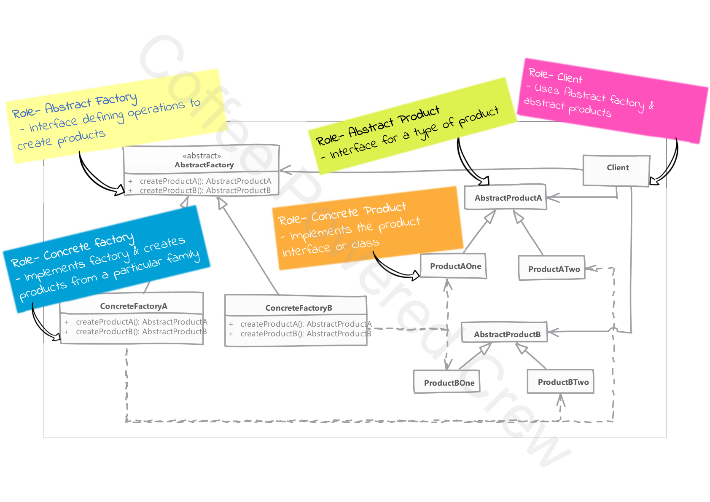
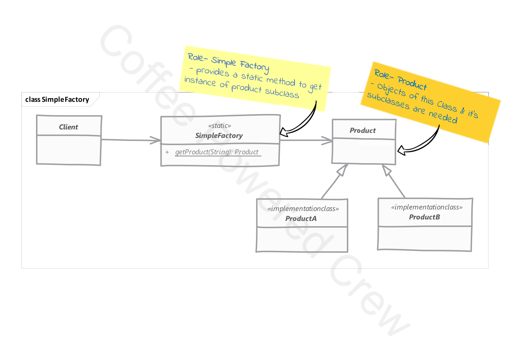
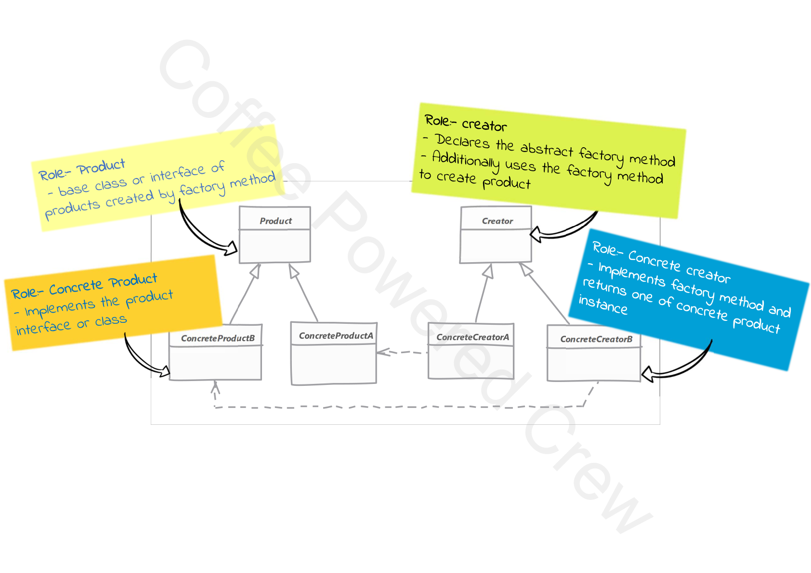
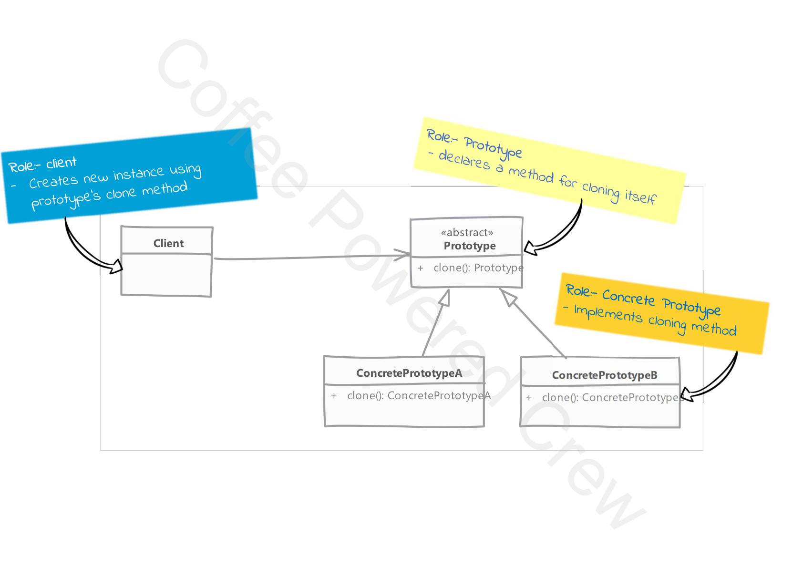
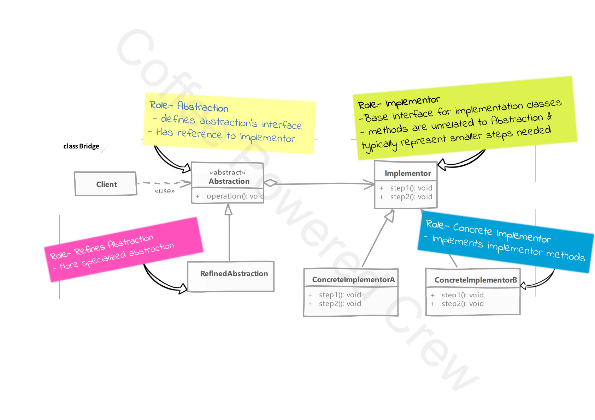
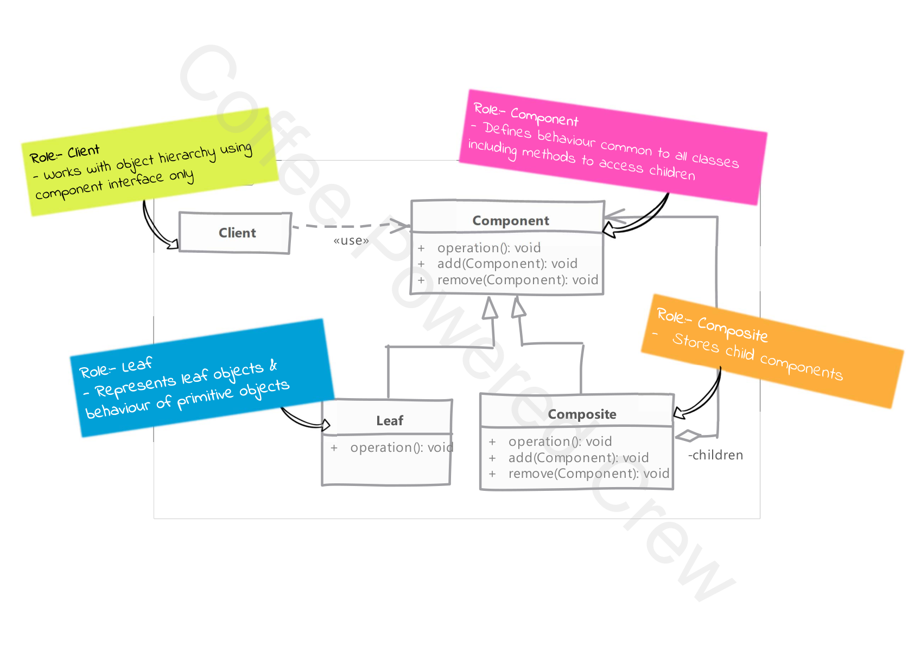
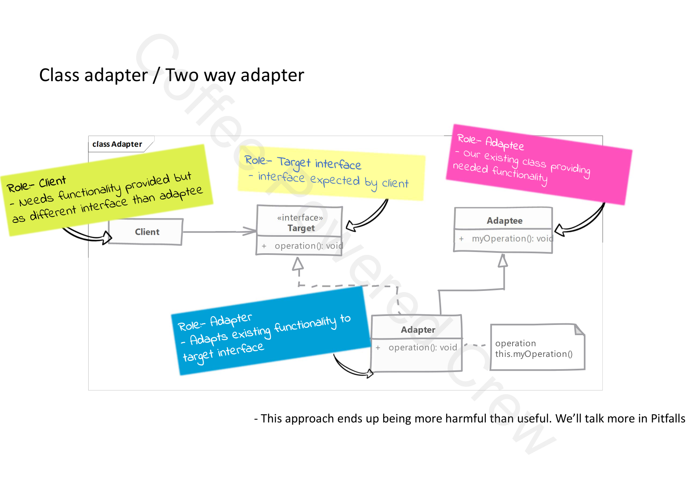
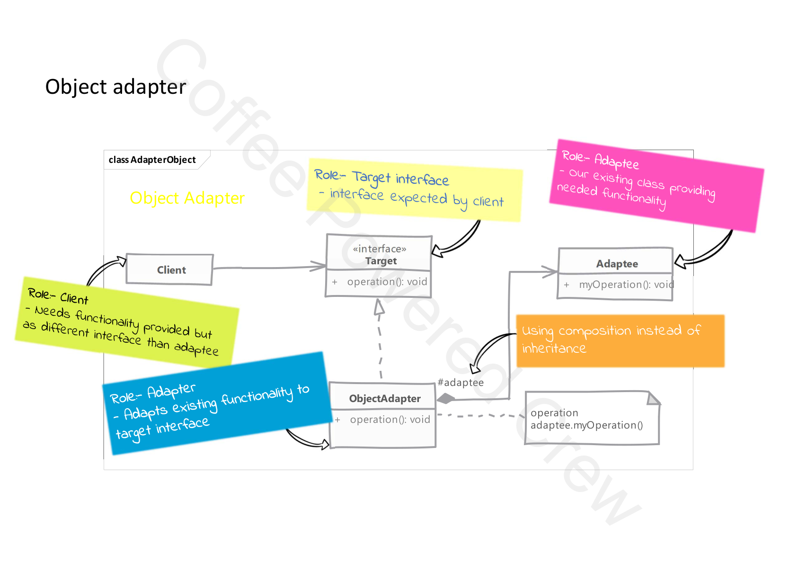

# Design Patterns Guide

This repository is a compact revision guide for key design patterns. More patterns to come....

## Revision PDFs Covered

- [Abstract Factory](Revision/Abstract+Factory.pdf)
- [Builder](Revision/Builder.pdf)
- [Simple Factory](Revision/Simpe+Factory.pdf)
- [Factory Method](Revision/Factory+Method.pdf)
- [Prototype](Revision/Prototype.pdf)
- [Bridge](Revision/Bridge.pdf)
- [Composite](Revision/Composite.pdf)
- [Class Adapter](Revision/Class+Adapter.pdf)
- [Object Adapter](Revision/Object_Adapter.pdf)

## UML Diagrams

### 1) Abstract Factory

### 2) Builder

### 3) Simple Factory

### 4) Factory Method

### 5) Prototype

### 6) Bridge

### 7) Composite

### 8) Class Adapter

### 9) Object Adapter

##### Guide Created by ☘︎ Soham Tripathy ☘︎
##### Contact +91 8919673304 for queries